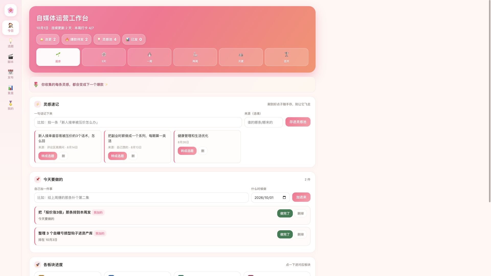

# 自媒体运营工作台

一份可直接打开的本地 HTML 工作台，以及在 WorkBuddy 资料库制作在线版的提示词和数据表模板。围绕「灵感 → 选题 → 脚本 → 发布 → 复盘」组织日常运营。

> [!IMPORTANT]
> `index.html` 是**本地演示版**。数据自动保存在当前浏览器的 `localStorage`，支持 JSON 备份导入导出和内容 CSV 导出；它本身不连接 WorkBuddy 在线数据表。需要在线存储和双向同步，请按 [在线版制作方法](docs/在线版制作方法.md) 在自己的 WorkBuddy 资料库里建立可编辑页面和表格，并完成双向验证。

## 预览

画面取自公开示例页；本地版保留了主要界面，并把云端文案改为本地存储说明。

## 直接使用本地版

1. 下载仓库，双击 `index.html`。
2. 从「今日」记灵感，在「选题」转成正式选题，再用「脚本」「发布」「复盘」继续处理。
3. 在「我的」中导出 JSON 备份。更换浏览器或电脑前先备份；在新设备导入 JSON。
4. 想用表格分析内容时，点击「导出内容 CSV」。CSV 只含内容记录，完整迁移请用 JSON。

无需安装依赖、外部字体或 CDN。浏览器清除网站数据时，本地记录可能一起清除；请定期导出备份。

## 制作在线资料库版

1. 打开 [完整提示词](prompt.md)，把自己的赛道、平台和风格需求改进去。
2. 把[公开示例页](https://workbuddy.link/p/VEmid0pCbQMW6V1GnGNAdm)与提示词一起发给 WorkBuddy；先请求「一键做同款」，没有该能力再按提示词搭建。
3. 按 [5 张数据表模板](tables/README.md)检查字段与关联 ID。
4. 在**自己的可编辑资料库页面**新增一条选题，检查在线表格是否出现；再在表格改标题，刷新页面检查是否回显。两步都通过才算完成双向同步。
5. 对外发布链接前检查示例数据和权限。WorkBuddy 官方说明中，「发布为网站」链接供只读访问；邀请协作才是编辑入口。

详细步骤和验收见 [在线版制作方法](docs/在线版制作方法.md)。

## 仓库内容

| 路径 | 内容 |
|---|---|
| `index.html` | 独立本地演示版，CSS 与 JS 内嵌 |
| `prompt.md` | WorkBuddy 在线版完整提示词 |
| `tables/` | 五张匿名示例数据表与字段说明 |
| `docs/在线版制作方法.md` | 制作流程、同步验收和排错 |
| `docs/提示词设计方法.md` | 如何按自己的赛道改提示词 |
| `assets/preview.png` | 本地演示版预览图 |

## 版本边界

- 本地 HTML：离线使用、当前浏览器自动保存、手动备份。不能把 `index.html` 直接上传后就宣称已接入云端。
- 在线资料库：由 WorkBuddy 在你的空间创建 HTML 与数据表，是否支持双向同步以实际验收为准。公开只读页与有权限的编辑页是两个入口。
- 示例数据：全是演示用虚构记录，可在「我的」清空。

原型页面来自上方公开示例页。本仓库保存的是去除其平台专用表 ID 与注入脚本后的独立版，并修正了本地版的数据说明。代码与文档采用 [MIT 许可证](LICENSE)。

## 参考

- [WorkBuddy 资料库](https://www.workbuddy.cn/docs/workbuddy/From-Beginner-to-Expert-Guide/Function-Description/Library)
- [WorkBuddy 轻量发布与 HTML + CSV](https://www.workbuddy.cn/docs/workbuddy/From-Beginner-to-Expert-Guide/Function-Description/Library/Lightweight-Publish)
